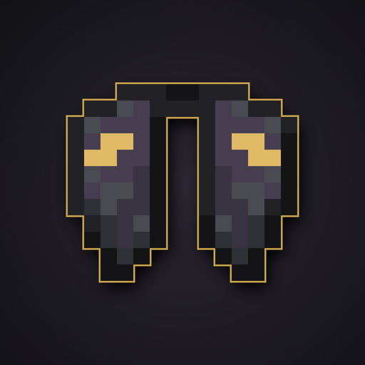

<div align="center">



# Netherite Plated Elytra Revived

**An upgraded elytra for Minecraft 26.1.2 / 26.2 (Fabric).**


</div>

Take your hard-earned elytra to the next tier the same way you upgrade any tool
or armor: at the **smithing table**, with a netherite upgrade template and a
netherite ingot.

> **Unofficial community mod.** Not affiliated with the original
> "Netherite Plated Elytra" project.

## ✨ Features

| | |
|---|---|
| 🔥 **Fireproof** | It will not burn in fire or lava. |
| 🛡️ **+4 Armor** | Granted while worn in the chest slot. |
| ❤️ **864 durability** | Exactly **2×** the vanilla elytra (432). |
| 🪶 **Glides** | Flies like the vanilla elytra — just better. |
| 🎨 **Netherite look** | Dark wings with subtle gold details (normal + broken). |

## 🔨 Crafting

Place these on a **Smithing Table**:

| Slot | Ingredient |
|---|---|
| Template | Netherite Upgrade Smithing Template |
| Base | Elytra |
| Addition | Netherite Ingot |
| **→ Result** | **Netherite Plated Elytra** |

## 📦 Installation

**Requirements**

- **Fabric Loader** `0.19.5+`
- **Fabric API** — **required** (Fabric API is what allows new items to be
  registered on 26.x)
- **Minecraft 26.2** or **26.1.2** — use the file that matches your game version

**Steps**

1. Install Fabric Loader for your Minecraft version.
2. Drop [Fabric API](https://modrinth.com/mod/fabric-api) and this mod into your
   `mods/` folder.
3. The mod must be installed on **both client and server** (same version).

## 🔧 Compatibility

- Works alongside **Do a Barrel Roll**, **Elytra HUD+** and any other elytra mod.
- Multiplayer-friendly: no mixins, no config, no performance impact.
- **Repairable** with netherite ingots in an anvil.

## 📥 Downloads

| Minecraft | File |
|---|---|
| 26.2 | `netherite-plated-elytra-1.0.0+26.2.jar` |
| 26.1.2 | `netherite-plated-elytra-1.0.0+26.1.2.jar` |

Available on Modrinth and in the [Releases](../../releases) tab.

## 🛠️ Building from source

Requires **JDK 25**.

```bash
./gradlew build
# -> build/libs/netherite-plated-elytra-1.0.0+26.2.jar
```

To build for another Minecraft version, override the properties (no file edits
needed):

```bash
./gradlew clean build \
  -Pminecraft_version=26.1.2 \
  -Pfabric_api_version=0.155.3+26.1.2 \
  -Pmod_version=1.0.0+26.1.2
```

> **Note (26.x):** Minecraft 26.x ships **unobfuscated**, so there is no Yarn or
> Mojang mappings. This project uses the **no-remap** Loom plugin
> (`net.fabricmc.fabric-loom`) and declares **no** `mappings`. Also, registries
> are frozen before `onInitialize()` on 26.x, so **Fabric API is required at
> runtime** to register the item.

Project layout:

```
src/main/java/netheriteelytra/NetheriteElytraMod.java   # item registration
src/main/resources/                                     # fabric.mod.json, assets, recipe
tools/gen_textures.py                                   # regenerates textures from vanilla
tools/gen_icon.py                                       # regenerates the project icon
art/                                                    # project icon
```

## 📄 License

Code is released under the **MIT License** — see [LICENSE](LICENSE).

Item textures are a recolored derivative of Mojang's vanilla elytra texture.
Minecraft is a trademark of Mojang Synergies AB. This project is not affiliated
with or endorsed by Mojang or Microsoft.

## 💬 Issues

Found a bug or have a suggestion? Open an
[issue](../../issues).
